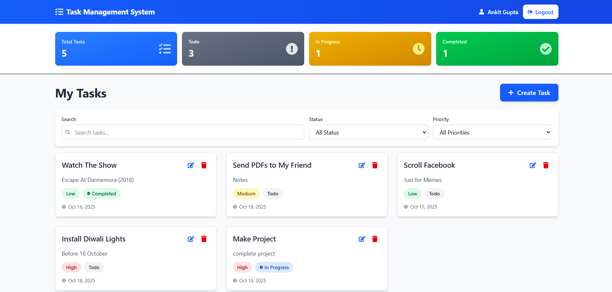

# Task Management System

A full-stack task management application built with the MERN stack (MongoDB, Express.js, React, Node.js) featuring user authentication, CRUD operations, filtering, and statistics dashboard.

<p align="center">
  
</p>

## Installation and Usage

### Prerequisites

- Node.js (v14 or higher)
- MongoDB (local or Atlas)
- npm or yarn

### Backend Setup

1. Navigate to backend directory:

```bash
cd backend
```

2. Install dependencies:

```bash
npm install
```

3. Create `.env` file in the backend directory:

```env
PORT=8000
MONGODB_URI=mongodb://localhost:27017/task-management
JWT_SECRET=your_super_secret_jwt_key_here_min_32_chars
JWT_EXPIRES_IN=7d
NODE_ENV=development
CORS_ORIGIN=http://localhost:5173
```

4. Start the backend server:

```bash
npm start
```

Backend will run on `http://localhost:8000`

### Frontend Setup

1. Navigate to frontend directory:

```bash
cd frontend
```

2. Install dependencies:

```bash
npm install
```

3. Create `.env` file in the frontend directory:

```env
VITE_API_BASE_URL=http://localhost:8000
```

4. Start the frontend development server:

```bash
npm run dev
```

Frontend will run on `http://localhost:5173`

### Usage

1. Open your browser and navigate to `http://localhost:5173`
2. Register a new account or login with existing credentials
3. Create, view, edit, and delete tasks
4. Use filters to organize tasks by status and priority
5. Search for specific tasks
6. View your task statistics on the dashboard

---

## Features

### Authentication & Authorization

- ✅ User registration with email and password
- ✅ Secure login with JWT token authentication
- ✅ Protected routes (frontend and backend)
- ✅ Logout functionality
- ✅ HTTP-only cookies for enhanced security
- ✅ Password hashing with bcrypt

### Task Management

- ✅ **Create Tasks**: Add tasks with title, description, priority, status, and due date
- ✅ **View Tasks**: Display all tasks in a responsive grid/list view
- ✅ **Update Tasks**: Edit task details and change status
- ✅ **Delete Tasks**: Remove tasks with confirmation
- ✅ **Filter Tasks**: By status (Todo/In Progress/Completed) and priority (Low/Medium/High)
- ✅ **Search Tasks**: Search by title or description
- ✅ **Date Validation**: Cannot select past dates for due dates
- ✅ **Overdue Indicator**: Visual alert for overdue tasks

### Dashboard Statistics

- ✅ Total tasks count
- ✅ Completed tasks count
- ✅ Pending tasks count (Todo + In Progress)
- ✅ Tasks breakdown by priority
- ✅ Real-time statistics updates

### UI/UX Features

- ✅ Responsive design (mobile, tablet, desktop)
- ✅ Modern, clean interface with Tailwind CSS
- ✅ Toast notifications for user feedback
- ✅ Loading states and error handling
- ✅ Empty states and confirmation dialogs
- ✅ Optimized for high-resolution screens

---

## Tech Stack

### Frontend

- **React 18** - UI library
- **Vite** - Build tool
- **React Router DOM** - Routing
- **Axios** - HTTP client
- **Tailwind CSS** - Styling
- **React Icons** - Icon library
- **React Toastify** - Notifications

### Backend

- **Node.js** - Runtime environment
- **Express.js** - Web framework
- **MongoDB** - Database
- **Mongoose** - ODM
- **JWT** - Authentication
- **Bcrypt** - Password hashing
- **Joi** - Input validation
- **Cookie Parser** - Cookie handling
- **CORS** - Cross-origin resource sharing

---

## Thanks
